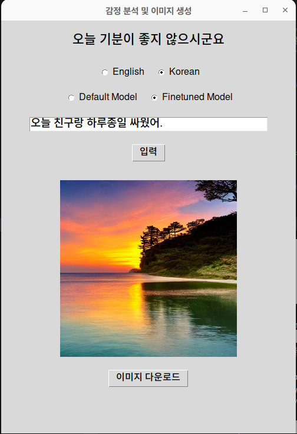

## 감정 분석 및 이미지 생성 애플리케이션
이 애플리케이션은 사용자가 입력한 감정 텍스트를 분석하여 감정에 맞는 이미지를 생성하는 프로그램입니다. 두 가지 언어 모드(영어, 한국어)와 모델(기본 모델, 미세 조정된 모델)을 선택하여 감정 분석을 수행하고, 그 결과로 감정을 시각적으로 표현한 이미지를 제공합니다. 이 애플리케이션은 Python의 Tkinter 라이브러리를 사용한 GUI 프로그램입니다.

### Build Enviromnents
가상환경에서 사용하세요
``` 
pip install transformers accelerate datasets peft bitsandbytes
pip install torch torchvision torchaudio 
pip install numpy==1.26.3
```

### Demo app
<p align="center">
    
    
</p>


### Demo app 사용방법 
0. demo.py 파일 실행 
demo 파일을 실행하면 어플리케이션이 실행됩니다.  
1. 언어 모드 선택
사용자는 English(영어) 또는 Korean(한국어) 중 하나를 선택하여 감정 분석을 수행할 수 있습니다.  
언어는 감정 텍스트 분석 시에 적용됩니다.  
2. 모델 선택
Default Model(기본 모델): 미세 조정되지 않은 일반 모델을 사용하여 감정 분석을 수행합니다.  
Finetuned Model(미세 조정된 모델): 사용자가 추가 학습을 통해 미세 조정한 모델을 사용하여 감정 분석을 수행합니다. (모델이 없으면 error를 발생합니다. )
3. 감정 입력 필드
사용자는 텍스트 입력 필드에 감정을 설명하는 문장을 입력할 수 있습니다.
입력된 텍스트는 감정 분석에 사용됩니다.
4. 감정 분석 실행
입력 버튼을 클릭하거나 Enter 키를 누르면 감정 분석이 실행됩니다.
감정 분석이 완료되면 해당 감정을 바탕으로 생성된 이미지가 표시됩니다.
5. 이미지 다운로드
감정 분석 후 생성된 이미지를 다운로드할 수 있는 버튼이 제공됩니다.
이미지 다운로드 버튼을 클릭하여 분석 결과로 생성된 이미지를 저장할 수 있습니다.

### Fine-tuning 
eng : fintuning_eng.py 실행  
kor : preprocess.py 실행 후 fintuning_kor.py 실행 

### 주의할점 
1. README.md가 있는 곳이 pwd가 되도록하고 실행합니다. 
2. finetuned model은 마지막 index인 모델 (최근에 학습한 모델)을 사용합니다. 
3. Default는 eng만 하는 것을 추천합니다. 
